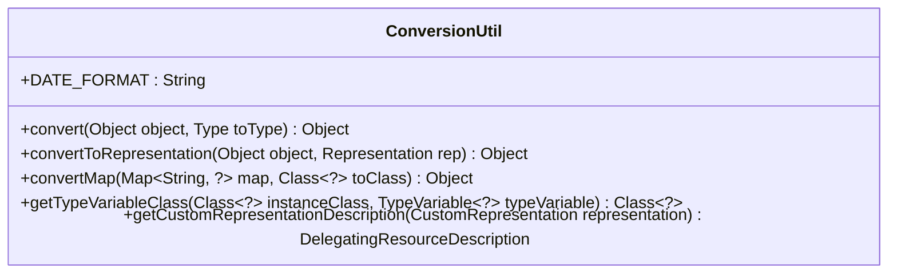
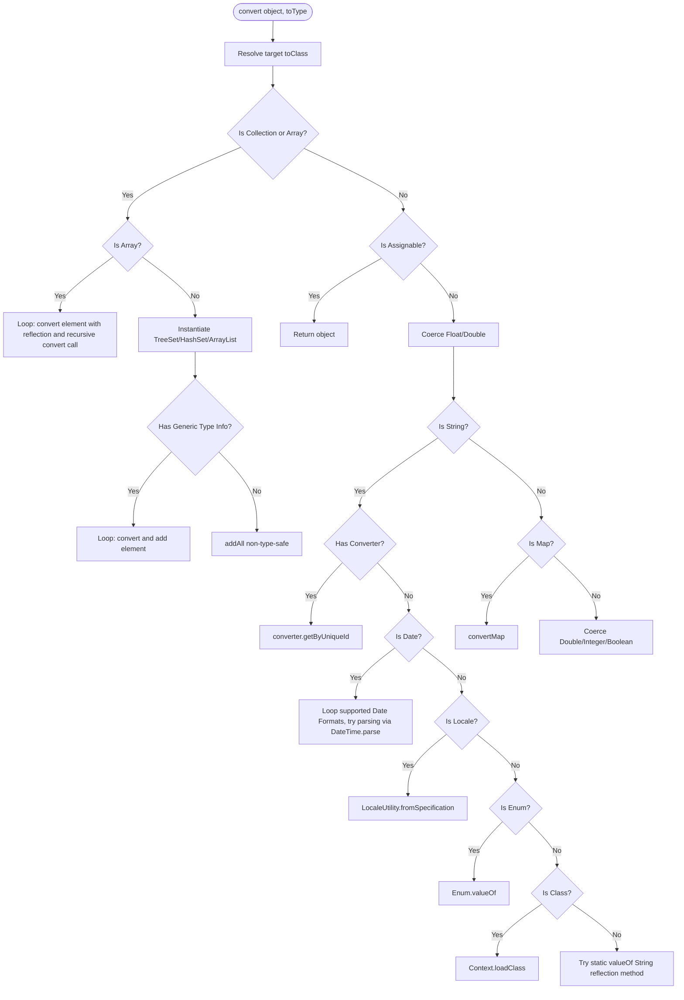
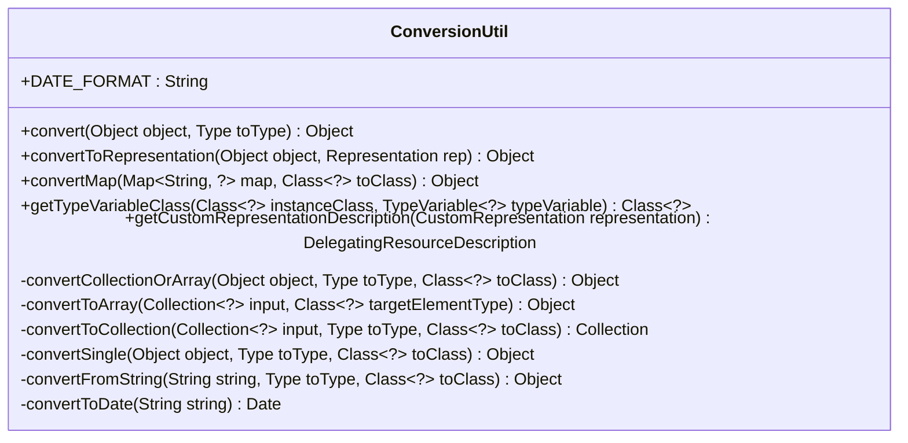
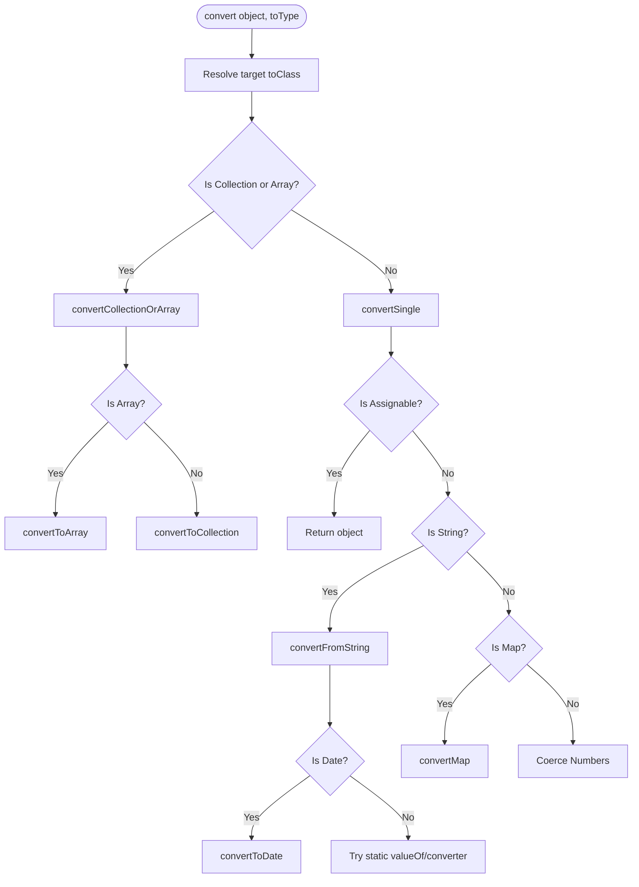

# Design Comparison: ConversionUtil

This document provides a UML representation, maintainability comparison, and test analysis of the original design of ConversionUtil (located at `omod-common/src/main/java/org/openmrs/module/webservices/rest/web/ConversionUtil.java`) with the new refactored structure.

---

## 1. Original Design (Monolithic)

In the original design, `convert(Object, Type)` is a single, complex method that handles all types of conversion internally, leading to high cognitive complexity and poor readability.

### Class Diagram (Original)


### Flowchart (Original)


---

## 2. Altered Design (Modularized)

The refactored design decomposes the complex logic into distinct private helper methods, isolating different conversion concerns.

### Class Diagram (Altered)


### Flowchart (Altered)


---

## 3. Cognitive Complexity Comparison

Cognitive Complexity measures how difficult a method is to understand by looking at nesting, control flow changes, and catch blocks.

### A. Before Refactoring (Complexity: 36)
The original `convert` method is monolithic and deeply nested:
* Base checks (`null` check, type resolution): **+2**
* Collection / Array conversion block: **+11** (Nesting level 3 for element loops, concrete class checks).
* Primitive and Type coercion checks: **+5**
* String-to-type parsing block: **+16** (Nesting level 4 for try-catch inside the date format loop, plus enum/locale/class checks).
* Map/Number coercion checks: **+2**

### B. After Refactoring (Highest Method Complexity: 8)
By decomposing the method, the structural nesting is flattened:

| Method Name | Complexity | Primary Driver |
| :--- | :---: | :--- |
| `convert` | **3** | Type resolution and collection routing. |
| `convertCollectionOrArray` | **2** | Collection validation and array check. |
| `convertToArray` | **1** | Single loop. |
| `convertToCollection` | **6** | Collection instantiation options. |
| `convertSingle` | **7** | Type coercion routing. |
| `convertFromString` | **8** | Date/Locale/Enum/Class/Reflection lookups. |
| `convertToDate` | **3** | Date format loop and try-catch. |

---

## 4. Usage & Verification Analysis

### A. Method Usages (47 References)
* **29 usages** in core logic (converts path variables, request params, and payload fields to domain objects).
* **18 usages** in test suites (converts mock request values or checks assertions).

### B. Verification Strategies
To ensure `ConversionUtil.convert` is called correctly at target places:
1. **Mocking Static References**: In JUnit tests, isolate behavior using Mockito static mocks:
   ```java
   try (MockedStatic<ConversionUtil> mocked = Mockito.mockStatic(ConversionUtil.class)) {
       mocked.when(() -> ConversionUtil.convert(any(), any())).thenReturn(expectedValue);
       // execute and verify...
       mocked.verify(() -> ConversionUtil.convert(inputValue, targetType));
   }
   ```
2. **Integration Verification**: Validate REST requests map strings (UUIDs, ISO-8601 dates) to correct domain models inside active DB transactions.

---

## 5. Coverage Gaps (For 100% Coverage)

To achieve complete test coverage on the refactored code, tests in `omod-common/src/test/java/org/openmrs/module/webservices/rest/web/ConversionUtilTest.java` must cover:

* **Null Input**: `convert(null, toType)` must return `null`.
* **Missing @Test Annotation**: Fix missing annotations on `convert_shouldConvertIntToDouble` and `convert_shouldConvertDoubleToInt`.
* **Collection Format Error**: Passing single object to target collection (should throw `ConversionException`).
* **Unsupported Collection Type**: Trying to convert to `Queue` (should throw `ConversionException`).
* **Raw Collection type**: Verifying execution of `ret.addAll` for raw type targets.
* **Float Primitive Coercion**: Target `Float.class` with `Double` type.
* **Date Parsing Failure**: Invalid date formats (should throw `ConversionException` wrapping `IllegalArgumentException`).
* **Enum Parsing Failure**: Invalid enum string names.
* **Class Loading Failure**: Non-existent class name strings.
* **Boolean to String**: Target `String.class` with `Boolean` type.
* **Static valueOf Fallback**: Custom classes with static `valueOf` methods.
* **Unsupported Conversions**: Standard incompatible types.
