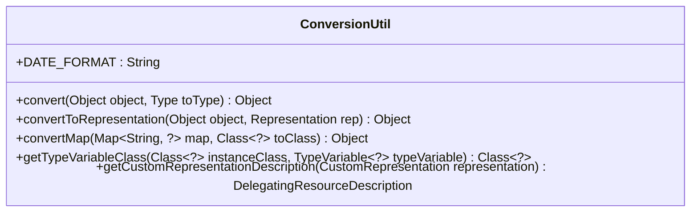
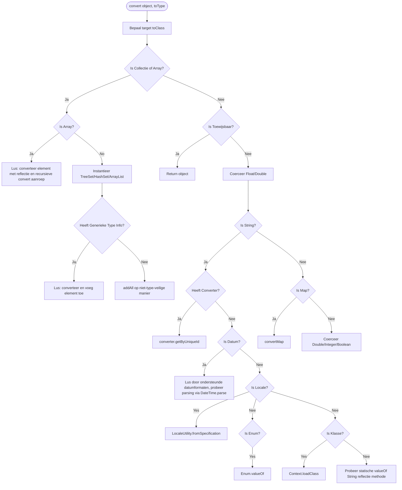
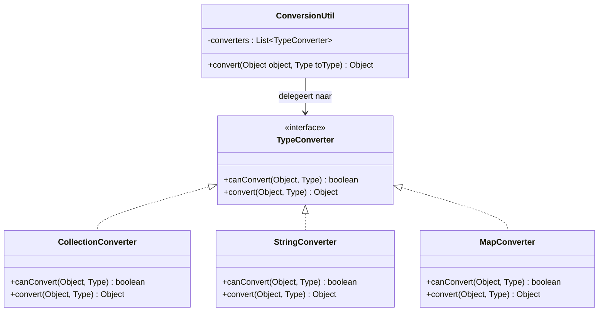
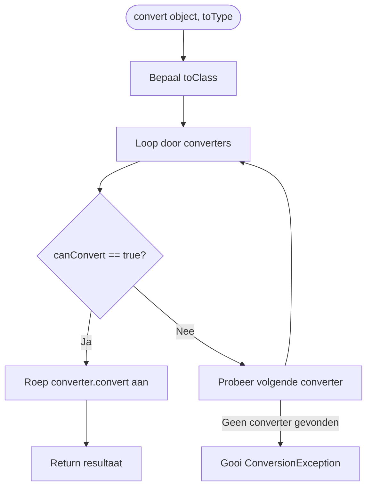

# Ontwerpvergelijking & Refactoring Blauwdruk

Dit document biedt een UML-weergave, onderhoudbaarheidsvergelijking en refactoringsplannen voor de klassen en methoden in de OpenMRS Web Services REST-module die onze onderhoudbaarheidswaarden schenden.

---

## 1. Origineel Ontwerp (Monolithisch)

In het originele ontwerp is `convert(Object, Type)` een enkele, complexe methode die alle typen conversie intern afhandelt, wat leidt tot een hoge cognitieve complexiteit en slechte leesbaarheid.

### Klasse Diagram (Origineel)

### Stroomdiagram (Origineel)

---

## 2. Nieuw Ontwerp (Modularisatie & Strategy/Registry Patroon)

Het gerefactorde ontwerp splitst de monoliet op door gebruik te maken van een **Strategy Patroon** in combinatie met een **Registry**. `ConversionUtil` delegeert de specifieke conversies naar afzonderlijke `TypeConverter`-implementaties die geregistreerd staan in een lijst.

### Klasse Diagram (Nieuw)

### Stroomdiagram (Nieuw)

---

## 3. Cognitieve Complexiteit Vergelijking

Cognitieve Complexiteit meet hoe moeilijk een methode te begrijpen is op basis van nestingsniveaus en control-flow wijzigingen.

### A. Voorheen (Complexiteit: 36)
De originele `convert` methode is monolithisch en diep genest:
* Basis controles (`null` check, typebepaling): **+2**
* Collectie / Array conversieblok: **+11** (Nestingniveau 3 voor lussen, typecontroles).
* Primitive & Type coercie: **+5**
* String-naar-type parsing: **+16** (Nestingniveau 4 door try-catch in datumlus, plus enum/locale/klasse checks).
* Map/Boolean coercie: **+2**

### B. Na Refactoring (Maximale Complexiteit: 8)
Door de methode te ontleden naar losse Strategy-klassen is de nesting volledig vlak:

| Methode/Klasse | Complexiteit | Belangrijkste Oorzaak |
| :--- | :---: | :--- |
| `convert` (Hoofdingang) | **3** | Typebepaling en doorlopen register. |
| `CollectionConverter` | **6** | Type-instantiering en lus. |
| `MapConverter` | **2** | Delegatie naar `convertMap`. |
| `StringConverter` (inclusief Datum/Enum) | **8** | Afhandeling datum lussen en reflectie try-catches. |

#### StringConverter — concrete gedrag

De huidige `StringConverter`-implementatie volgt het strategie/registry-ontwerp en ondersteunt de volgende conversieroutes wanneer de bron een `String` is:

- Converter registry: als er een `Converter` geregistreerd is voor het target `toClass`, wordt `getByUniqueId(String)` gebruikt.
- Datumparsing: probeert een vaste lijst van datumformaten (ISO-achtige en eenvoudige datum/tijd-formaten). De parser gebruikt `DateTimeFormatter.parseBest(...)` en accepteert `ZonedDateTime`, `OffsetDateTime`, `LocalDateTime` en `LocalDate`. De geaccepteerde patronen zijn onder andere:
  - `yyyy-MM-dd'T'HH:mm:ss.SSSZ`
  - `yyyy-MM-dd'T'HH:mm:ss.SSSXXX`
  - `yyyy-MM-dd'T'HH:mm:ss.SSSXX`
  - `yyyy-MM-dd'T'HH:mm:ss.SSSx`
  - `yyyy-MM-dd'T'HH:mm:ss.SSSX`
  - `yyyy-MM-dd'T'HH:mm:ss.SSS`
  - `yyyy-MM-dd'T'HH:mm:ssZ`
  - `yyyy-MM-dd'T'HH:mm:ssXXX`
  - `yyyy-MM-dd'T'HH:mm:ssXX`
  - `yyyy-MM-dd'T'HH:mm:ssx`
  - `yyyy-MM-dd'T'HH:mm:ssX`
  - `yyyy-MM-dd'T'HH:mm:ss`
  - `yyyy-MM-dd HH:mm:ss`
  - `yyyy-MM-dd`
  Geparste tijdstippen worden omgezet naar `java.util.Date` via de juiste tijdzone (`ZonedDateTime`/`OffsetDateTime`) of het systeemzone voor lokale types.
- Locale: `LocaleUtility.fromSpecification(String)` wordt gebruikt om `Locale`-waarden te maken.
- Enum: de `String` wordt omgezet via `Enum.valueOf(...)` met `string.toUpperCase()` om hoofdlettergevoeligheid te normaliseren.
- Class: probeert `Context.loadClass(String)` om een `Class`-object te laden; bij failure wordt een `ConversionException` gegooid.
- Reflectieve `valueOf(String)`: zoekt een publieke statische `valueOf(String)`-methode op het doeltype en gebruikt die wanneer beschikbaar.

Als geen route van boven toepasbaar is, gooit de converter een `ConversionException` met een duidelijke foutmelding.

Opmerking: de datumformatenlijst en parsingstrategie zijn gedocumenteerd hier omdat ze impact hebben op integraties die timezone-aware timestamps vereisen (bijv. webhooks die OffsetDateTime gebruiken). Als er afwijkende ISO-varianten nodig zijn, werk dan de `StringConverter`-implementatie bij en synchroniseer dit gedeelte van het ontwerpdocument.

---

## 4. Refactoringsplannen voor overige klassen & methoden

Hieronder staan de verbeterplannen voor de overige gedetecteerde knelpunten in de codebase, gegroepeerd per oplossingspatroon.

### Patroon A: Klasse Decompositie (Klassen > 500 LOC verkleinen)

#### 1. RestUtil (918 LOC)
* **Probleem**: Schendt het Single Responsibility Principle (SRP) door IP-matching, validatie-afhandeling, context-parsing en classpath-scanning te mixen.
* **Refactoringsplan**:
  * Pas het **Strategy Patroon** toe op IP-matching. Extraheer deze logica (`ipMatches`) naar een `IpMatcher`-interface en concrete klassen (`CidrIpMatcher`, `ExactIpMatcher`).
  * Extraheer de package-scanner (`getClassesForPackage`) naar een afzonderlijke helperklasse `ClasspathPackageScanner.java`.
  * Extraheer de Spring validatiefout-formatter (`wrapValidationErrorResponse`) naar `ValidationErrorFormatter.java`.
* **Resultaat**: `RestUtil` krimpt naar **< 300 LOC**.

#### 2. BaseDelegatingResource (903 LOC)
* **Probleem**: Enorme basisklasse die generieke reflectie-analyse, serialisatie, caching en updates uitvoert.
* **Refactoringsplan**:
  * Extraheer eigenschapsbinding en reflectiemutatiechecks (`setConvertedProperties`, `setProperty`, `getProperty`) naar een aparte delegate-klasse `ResourcePropertyBinder.java`.
* **Resultaat**: Grootte klasse daalt naar **~450 LOC**.

#### 3. RestServiceImpl (738 LOC)
* **Probleem**: Beheert serviceoperaties naast zeer verbose zoekhandler matching- en filterlogica.
* **Refactoringsplan**:
  * Extraheer de zoekhandler registries en filterfuncties (`getSearchHandler`, `eliminateCandidateSearchHandlersWithMissingRequiredParameters`) naar `SearchHandlerRegistry.java`.
* **Resultaat**: `RestServiceImpl` krimpt naar **~400 LOC**.

---

### Patroon B: Methode Extractie & Nesting Verminderen (Complexe methoden vereenvoudigen)

#### 4. RestUtil.getClassesForPackage (93 LOC, Complexiteit ~50)
* **Probleem**: Diep geneste lussen en try-catch blokken die gelijktijdig bestandssystemen en JAR-stromen scannen.
* **Refactoringsplan**:
  * Extraheer het scannen van mappen naar `scanDirectories(File, String, List)`.
  * Extraheer de JAR-scanner naar `scanJarConnection(JarURLConnection, String, List)`.

#### 5. RestUtil.ipMatches (61 LOC, Complexiteit ~35)
* **Probleem**: Complexe byte-vergelijkingen en CIDR-splitsingen uitgevoerd binnen diepe branches.
* **Refactoringsplan**:
  * Pas het **Strategy Patroon** toe (zie Patroon 2 in `design_patterns.md`). Delegeer de controles naar specifieke IP matchers (`CidrIpMatcher` en `ExactIpMatcher`).

#### 6. RestServiceImpl.getSearchHandler & eliminateCandidateSearchHandlersWithMissingRequiredParameters
* **Probleem**: Hoge cognitieve complexiteit (~25 en ~30) bij het controleren van handlers en filteren van parameters.
* **Refactoringsplan**:
  * Extraheer criteriaverificatie: delegeer parametercontroles naar een helpermethode `hasAllRequiredParameters(SearchHandler, Set)`.
  * Vervang geneste iterators door schone Java Streams.

#### 7. BaseDelegatingResource.init (37 LOC, Complexiteit ~21)
* **Probleem**: Geneste reflectie checks om de juiste OpenMRS-versie te binden aan resources.
* **Refactoringsplan**:
  * Extraheer de reflectieve generieke klasse-resolutie naar een helperklasse `GenericTypeResolver`.

---

## 5. Analyse Gebruik & Testdekking (ConversionUtil.convert)

### A. Methode Usages (47 Verwijzingen)
* **29 aanroepen** in kernlogica (REST input mapping en UUID omzettingen).
* **18 aanroepen** in test suites.

### B. Test Gaps (Voor 100% Coverage)
Om volledige dekking te krijgen op de refactorde code, moeten tests in `ConversionUtilTest.java` de volgende situaties dekken:
* **Null Input**: `convert(null, toType)` moet `null` retourneren.
* **Missende @Test Annotaties**: Herstel de missende annotations op `convert_shouldConvertIntToDouble` and `convert_shouldConvertDoubleToInt`.
* **Collectiefout**: Single object doorgeven aan een collectie target (moet `ConversionException` gooien).
* **Niet-ondersteund Collectietype**: Converteren naar een `Queue` type.
* **Raw Collection type**: Verifiëren van `ret.addAll` route voor raw targets.
* **Float Coercie**: Target `Float.class` met `Double` bronwaarde.
* **Foutieve Datums**: Ongeldige datumformaten (moet `ConversionException` gooien).
* **Enum Fout**: Foutieve enum namen.
* **Klasse-laad Fout**: Ongeldige klasse naam strings.
* **Boolean naar String**: Target `String.class` with `Boolean` type.
* **Static valueOf**: Custom klasse met static `valueOf`.
* **Incompatibele Typen**: Incompatibele types omzetten.
