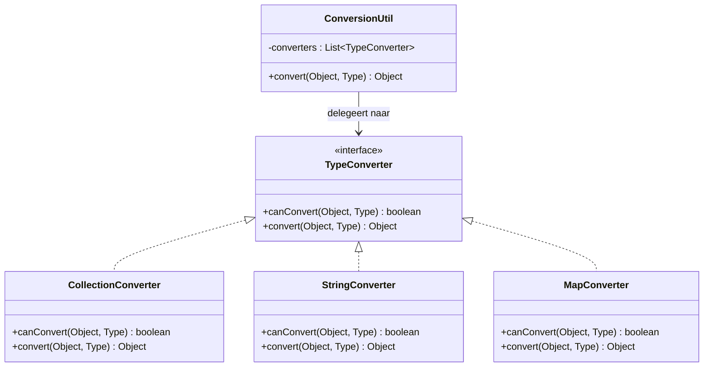
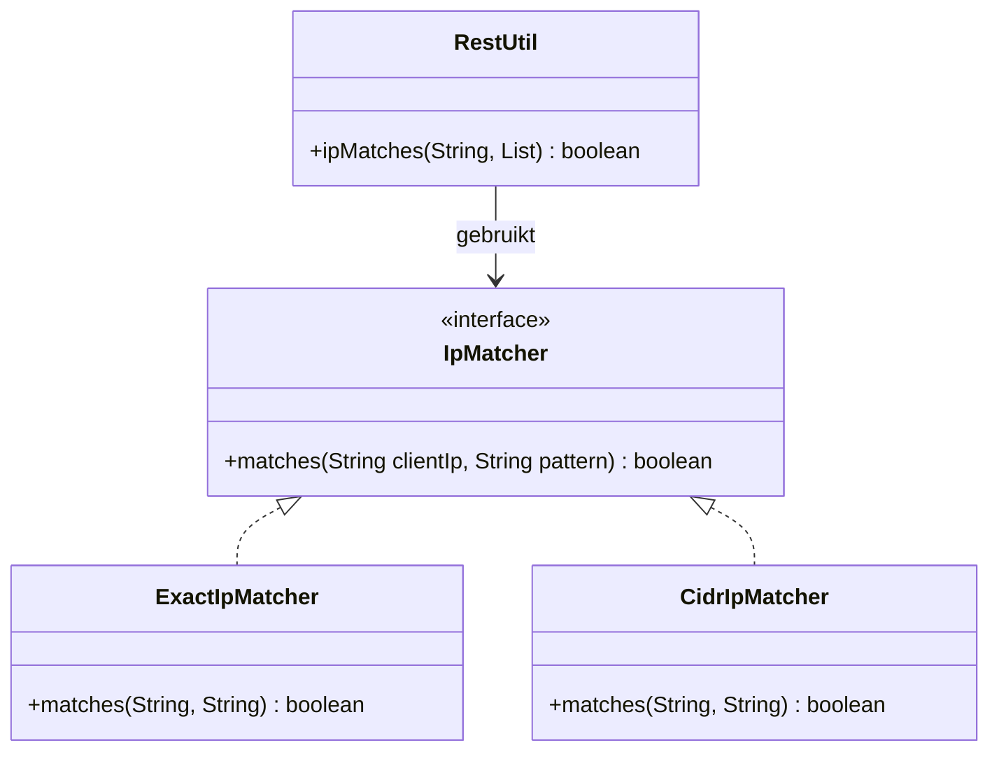

# Ontwerppatroon: Strategy & Registry voor Conversie en IP-Matching

Dit document beschrijft hoe we ontwerppatronen (**Strategy** en **Registry**) kunnen toepassen op de geïdentificeerde onderhoudbaarheidsknelpunten in `ConversionUtil` en `RestUtil`.

---

## Patroon 1: Strategy & Registry voor Typeconversie (ConversionUtil)

### 1. Probleem
De methode `ConversionUtil.convert(Object, Type)` is momenteel een monoliet met een cognitieve complexiteit van **36**. Het selecteert conversielogica op basis van complexe type-inspecties (`instanceof Class`, `isAssignableFrom`, `Collection.class.isAssignableFrom`, etc.) in een grote `if-else`-cascade. Dit schendt het **Open/Closed Principle (OCP)**; het toevoegen van een nieuw converteerbaar type vereist het wijzigen van de kern-methode.

### 2. Overwogen alternatieven
* **Template Method:** Een abstracte conversieklasse met hook-methodes. Afgewezen: Conversie-logica is statisch en universeel beschikbaar; overerving is hier te rigide.
* **Chain of Responsibility:** Converteerders die elkaar aanroepen. Afgewezen: Dit maakt de volgorde impliciet en lastiger te debuggen dan een expliciet register.

### 3. Oplossing: Strategy & Registry
We introduceren een `TypeConverter`-interface (de **Strategy**) en een centraal register (de **Registry**) in `ConversionUtil`.

#### UML (Conceptueel)


#### Code Voorbeeld
```java
public interface TypeConverter {
    boolean canConvert(Object source, Type targetType);
    Object convert(Object source, Type targetType) throws ConversionException;
}
```

#### 4. Het Registry-patroon Toegelicht
Het Registry-patroon (Register) is een ontwerppatroon dat fungeert als een centrale catalogus voor objecten of strategieën. In plaats van dat de client-klasse (`ConversionUtil`) direct weet welke concrete converteerders (`StringConverter`, `CollectionConverter`, enz.) er bestaan, houdt een centraal register (in dit geval een `List<TypeConverter>`) alle beschikbare strategieën bij. 

De client doorzoekt dit register via een lus om de juiste strategie te vinden (bijvoorbeeld door `canConvert` aan te roepen). Dit maakt het uiterst eenvoudig om nieuwe strategieën aan te melden of dynamisch te registreren, zonder de kern-conversielogica van `ConversionUtil` ooit te hoeven wijzigen (voldoet aan het Open/Closed Principle).

---

## Patroon 2: Strategy voor IP Range Matching (RestUtil)

### 1. Probleem
`RestUtil.ipMatches(String, List)` (61 LOC, Complexiteit **~35**) bevat inline logica voor zowel exacte IP-matching als CIDR subnet masking. Dit maakt het onderhoudsgevoelig en lastig uit te breiden naar bijvoorbeeld IPv6 subnetten.

### 2. Overwogen alternatieven
* **Eenvoudige Helpers:** Alleen helper-methoden in `RestUtil`. Afgewezen: Dit lost de schending van OCP niet op bij toekomstige uitbreidingen (bijv. regex-matching of IPv6-ranges).

### 3. Oplossing: Strategy Pattern
We definiëren een `IpMatcher`-interface en splitsen de matching-logica in aparte strategieën.

#### UML (Conceptueel)


---

## Gerealiseerde ISO 25010 Voordelen
* **Modificeerbaarheid (Modifiability):** Nieuwe conversies of IP-matchers toevoegen vereist enkel een nieuwe klasse, geen wijzigingen in de kern-util.
* **Testbaarheid (Testability):** Strategieën zijn geïsoleerd en afzonderlijk te unit-testen zonder nevenschade.
* **Herbruikbaarheid (Reusability):** Losse conversie-strategieën kunnen elders in de module direct worden aangeroepen.
