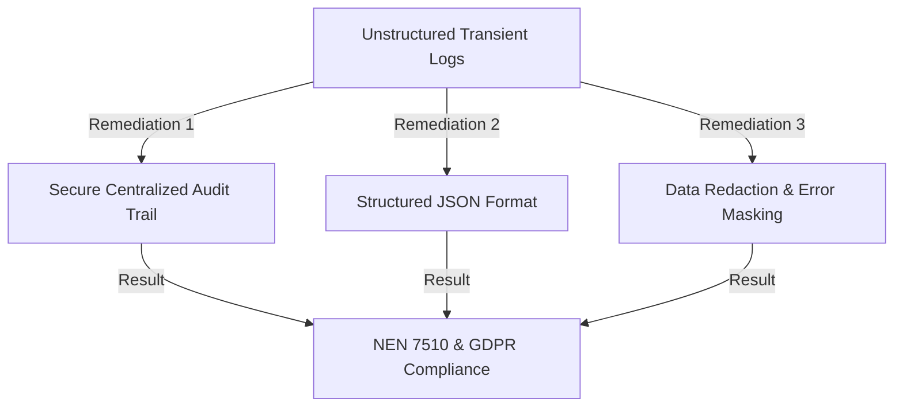

# OpenMRS REST Module - Logging & Audit Security Analysis Report

## 1. Executive Summary
This report analyzes the logging and audit capabilities of the `openmrs-module-webservices.rest` codebase. The focus is to evaluate logging practices against security, privacy, and compliance standards (NEN 7510:2024, GDPR, and HIPAA), specifically checking for immutability, format consistency, sensitive data exposure, and event coverage.

---

## 2. Analysis of the Logging Implementation

### 2.1 Immutability & Persistence
*   **Current Setup**: The module exposes a REST resource `/ws/rest/v1/serverlog` via `ServerLogResource1_8` and `ServerLogResource2_4`. This endpoint pulls from `MemoryAppender` in OpenMRS Core.
*   **Gaps**:
    1.  **Transient Storage**: In-memory logs (`MemoryAppender`) are lost upon JVM crash, restart, or module redeployment.
    2.  **No Integrity Protection**: File logs stored locally on the server filesystem lack cryptographic signatures or write-once-read-many (WORM) constraints. An administrator or successful attacker with local privileges can modify or delete log files to erase trace evidence.
    3.  **No Centralized Shipping**: There is no built-in capability in the module to forward audit logs to an external, isolated SIEM (Security Information and Event Management) or remote syslog server.
*   **Impact**: Non-compliance with NEN 7510 Control A.12.4.2 (Log Protection) and A.12.4.3 (Administrator Logs).

### 2.2 Format Consistency & Structural Reliability
*   **Current Setup**: `ServerLogActionWrapper.java` parses log lines using a regular expression:
    ```java
    String regExPatternType = "(INFO|ERROR|WARN|DEBUG)\\s.*?[-].*?\\s((?:[A-Za-z][A-Za-z].+))\\s[|](.*?)[|]\\s((.*\\n*)+)";
    ```
*   **Gaps**:
    1.  **Fragile Parser**: The parser expects logs to match a very specific textual pattern using pipes (`|`). If the logging layout configuration in OpenMRS Core is modified, the parser fails. It will either catch a `PatternSyntaxException` or return null array elements.
    2.  **No Structured Logging**: Logs are produced as unstructured plain text. There is no machine-readable layout (e.g., JSON) representing log elements consistently.
*   **Impact**: Parsing errors and incomplete log ingestion during automated security audits.

### 2.3 Exposure of Sensitive & Unneeded Data
*   **Current Setup**: `RestUtil.wrapErrorResponse` formats REST exceptions returned to users. `AuthorizationFilter.java` handles Basic Authentication.
*   **Gaps**:
    1.  **Internal Class Leakage**: The system exposes internal class names and code line numbers in the REST response body:
        ```java
        map.put("code", stackTraceElement.getClassName() + ":" + stackTraceElement.getLineNumber());
        ```
        This exposes internal logic paths to potential attackers (Information Disclosure - VULN-005).
    2.  **Stack Trace Disclosure**: If `enableStackTraceDetails` is set to `true`, the full Java stack trace is returned in the API response under `detail`, leaking database schemas, query logic, and dependencies.
    3.  **Credential Exfiltration Risk**: While `AuthorizationFilter` logs the username (`log.debug("authenticated [{}]", userAndPass[0]);`), it catches authentication exceptions and prints the stack trace (`log.debug("authentication exception ", ex)`). If exceptions (e.g., LDAP/DB connection failures) contain passwords or connection string credentials, they will be logged.
*   **Impact**: Violation of least-privilege principles and GDPR/NEN 7510 requirements to protect sensitive operational data.

### 2.4 Coverage & Audit Completeness
*   **Current Setup**: The module logs standard lifecycle stages (e.g., filter initialization) and system actions (e.g., clearing database caches).
*   **Gaps**:
    1.  **No Access Audit Logging**: There is no audit logging indicating when medical records (e.g., Patients, Encounters, Observations) are read. Accessing patient data through REST GET requests is not logged by default.
    2.  **Missing Security Actions**: Actions such as failed login attempts, IP blockings (from IP allow-list logic), and privilege checks are not systemically recorded in a dedicated audit log.
*   **Impact**: Inability to construct a forensic trail of patient data access (Critical violation of NEN 7510 Control A.12.4.1 - Event Logging).

---

## 3. Recommendations & Remediation Plan



### 3.1 Step 1: Ensure Immutability (Centralization)
*   **Action**: Configure OpenMRS logging backend (Log4j/Logback) to ship logs asynchronously to an external secure Syslog, SIEM, or cloud logging service (e.g., ELK, Splunk).
*   **Enforcement**: Restrict write access to local log files using OS-level permissions (e.g., root/service owner execution only, append-only file flags).

### 3.2 Step 2: Establish Consistent Structured Layout (JSON)
*   **Action**: Standardize auditing formats. Every security and access event must be logged using a structured JSON pattern:
    ```json
    {
      "timestamp": "ISO-8601",
      "severity": "INFO|WARN|ERROR",
      "principal": "User-UUID",
      "clientIp": "Client-IP-Address",
      "action": "HTTP-METHOD",
      "resource": "API-PATH",
      "status": "HTTP-STATUS-CODE",
      "message": "Action summary"
    }
    ```
*   **Enforcement**: Replace custom regex text parsing with direct JSON deserialization.

### 3.3 Step 3: Prevent Data Exposure
*   **Action**: Modify `RestUtil.wrapErrorResponse` to suppress line numbers, internal class paths, and stack traces when running in production.
*   **Redaction**: Enforce an automated log scrubber/filter in the logging framework configuration to mask passwords, Basic Auth headers, and sensitive session tokens from all outputs.

### 3.4 Step 4: Add Access and Security Audit Logging
*   **Action**: Introduce a Servlet Filter or Spring Interceptor to log every REST request targeting clinical resources (`/patient`, `/encounter`, `/obs`, `/person`).
*   **Event Fields**: Capture the requesting user's identity, the target patient's UUID, the action performed, and the timestamp.
