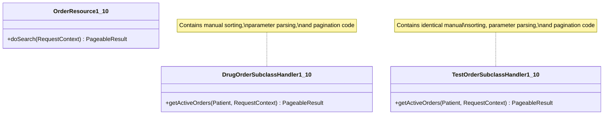
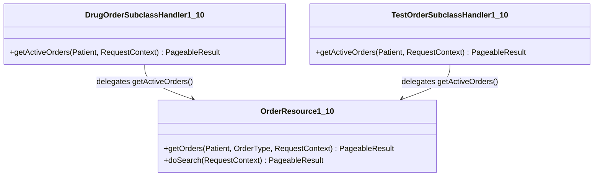

# Architecture & Redesign Document: Order Handlers Refactoring

This document describes the architectural changes implemented to resolve the code duplication between `DrugOrderSubclassHandler1_10` and `TestOrderSubclassHandler1_10`. It details the applied design patterns, UML diagrams representing the before/after structure, and discussions on rejected architectural alternatives.

---

## 1. Problem Identification (Before Refactoring)

Both `DrugOrderSubclassHandler1_10` and `TestOrderSubclassHandler1_10` need to fetch active orders for a patient via the REST API. Previously, their `getActiveOrders(...)` methods duplicated the following logic:
1. Extracting request parameters (`careSetting`, `asOfDate`, `sort`, `status`).
2. Fetching the patient using REST resources.
3. Invoking the core service `OrderUtil.getOrders` with matching parameters.
4. Implementing manual sorting and paging wrapping logic.

This duplication violated the **DRY (Don't Repeat Yourself)** principle and the **Single Responsibility Principle (SRP)**. Any change to sorting or paging logic had to be modified in multiple handler files, raising the risk of regression.

---

## 2. Before / After UML Diagrams

### Before Refactoring (Duplicated Logic)

### After Refactoring (Delegation to Parent Resource)

---

## 3. Applied Refactoring & Design Patterns

We applied Fowler's refactoring patterns:
1. **Extract Method / Move Method:** Extracted parameter parsing, sorting, and pagination logic into a new public method `getOrders(Patient, OrderType, RequestContext)` inside `OrderResource1_10`.
2. **Replace Duplicated Code with Function Call (Delegation):** Replaced the redundant logic in both subclass handlers with a simple delegation call to `OrderResource1_10.getOrders()`.

### Design Principles Met:
* **GRASP Information Expert:** `OrderResource1_10` owns the context and definitions of order schemas. Thus, it is the natural "expert" to parse request parameters and structure the pagination response for orders.
* **Low Coupling / High Cohesion:** The subclass handlers now have high cohesion, serving only as thin wrappers to determine the specific `OrderType` ("Drug order" or "Test order") and delegate execution.

---

## 4. Architectural Alternatives Evaluated

During the design phase, three architectural alternatives were considered and rejected:

### Alternative A: Extract Superclass (Pull Up Method)
* **Description:** Define a shared abstract parent class (e.g., `BaseOrderSubclassHandler`) and pull up the `getActiveOrders` implementation into it.
* **Why Rejected:** Java only supports single inheritance. The subclass handlers are already constrained by the framework inheritance hierarchy:
  * `DrugOrderSubclassHandler1_10` extends `DrugOrderSubclassHandler1_8` (which extends `BaseDelegatingSubclassHandler`).
  * `TestOrderSubclassHandler1_10` extends `BaseDelegatingSubclassHandler`.
  Forcing a common parent class would break version compatibility chains and introduce artificial layers into the framework.

### Alternative B: Template Method Pattern
* **Description:** Implement a template method in a base class that defines the execution skeleton, with subclass handlers overriding abstract "hooks" (e.g., `getOrderTypeName()`).
* **Why Rejected:** The only variation point is the name of the `OrderType`. A full Template Method pattern is over-engineering (violating the YAGNI principle) when a simple parameter passing via delegation achieves the exact same level of reuse.

### Alternative C: Strategy Pattern
* **Description:** Create a separate `OrderQueryStrategy` class to handle order search and sorting.
* **Why Rejected:** Introducing an additional strategy class adds indirect complexity without any real structural benefit, since the `OrderResource1_10` is already responsible for translating REST queries to services.
