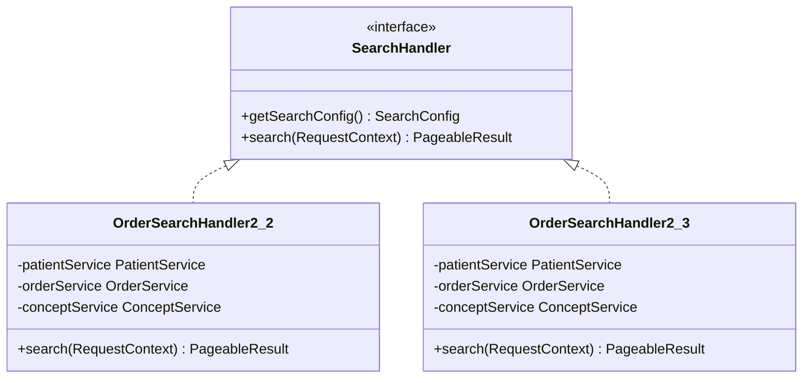
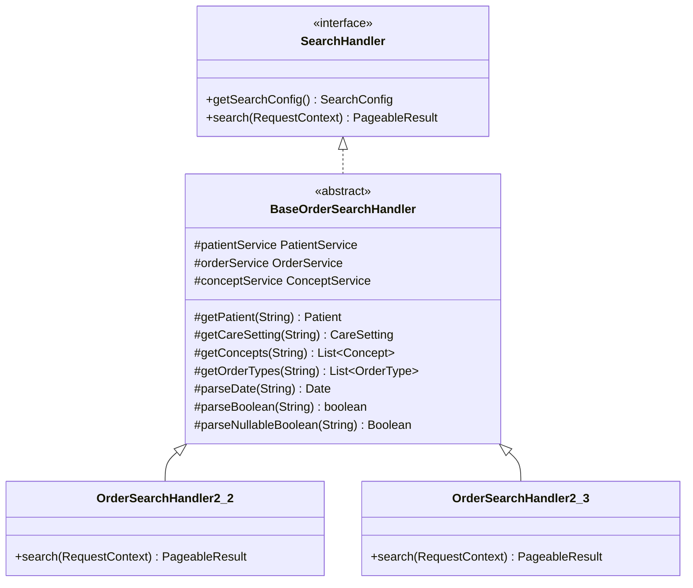

# Architecture & Redesign Document: Order Search Handlers Refactoring

This document describes the architectural changes implemented to resolve the code duplication between `OrderSearchHandler2_2` and `OrderSearchHandler2_3`.

---

## 1. Problem Identification

Both search handlers are version-specific implementations of the `SearchHandler` interface, designed to filter and search for orders. However, they duplicated the following logic:
1. Retrieval and validation of `Patient` and `CareSetting` domain objects by their UUID.
2. Parsing and splitting comma-separated lists of `Concept` and `OrderType` UUIDs, including validation and exception mapping.
3. Parsing ISO date strings and converting them to `java.util.Date` objects.
4. Parsing string boolean parameters.

This duplication violated the **DRY (Don't Repeat Yourself)** principle and led to high maintenance costs. Any changes to parsing semantics or validation exceptions would have to be duplicated across version folders.

---

## 2. Before / After UML Diagrams

### Before Refactoring

### After Refactoring

---

## 3. Applied Refactoring & Design Patterns

We applied the following Fowler's refactoring patterns:
1. **Extract Superclass:** Extracted the abstract parent class `BaseOrderSearchHandler` containing common logic.
2. **Pull Up Field:** Pulled up common service dependency fields (`patientService`, `orderService`, `conceptService`).
3. **Pull Up Method:** Pulled up helper methods for parameter parsing and object resolution.

### SOLID Principles Met:
* **Single Responsibility Principle (SRP):** The subclass handlers (`OrderSearchHandler2_2`/`OrderSearchHandler2_3`) are now solely responsible for defining their version-specific metadata and building the final `OrderSearchCriteria`. They no longer handle input parsing or object validation.
* **Open/Closed Principle (OCP):** The parsing engine in `BaseOrderSearchHandler` is closed for modifications but open to extension. Adding a new `OrderSearchHandler` version (e.g., `OrderSearchHandler2_4`) requires only inheriting from the base class and calling the helper methods.
* **Liskov Substitution Principle (LSP):** Subclasses can be substituted anywhere a `SearchHandler` is required, preserving interface contracts.
* **Interface Segregation Principle (ISP):** Client code only interacts with the generic `SearchHandler` interface.
* **Dependency Inversion Principle (DIP):** Dependencies are injected at the base class level, decoupled from specific implementation implementations.

---

## 4. Architectural Alternatives Evaluated

### Alternative A: Utility Class (Helper)
* **Description:** Place all parsing logic in a static utility class (e.g., `OrderSearchHelper`).
* **Why Rejected:** A utility class requires explicitly passing the autowired service dependencies (like `PatientService` or `ConceptService`) as arguments to every static method call, or turning the helper into a Spring bean and autowiring it inside the handlers. This introduces unnecessary boilerplate. Pulling up fields and methods into an abstract superclass is cleaner since both search handlers are closely related and share the exact same dependency context.
