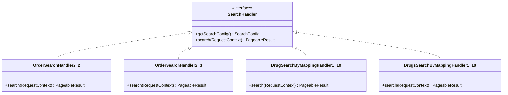
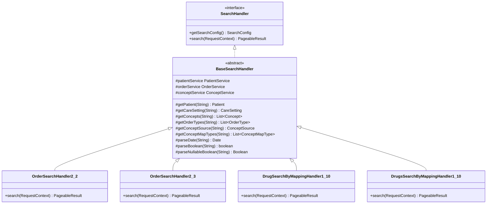

# Architecture & Redesign Document: Universal Search Handlers Refactoring

This document describes the architectural changes implemented to resolve code duplication across the version-specific search handlers of `openmrs-module-webservices.rest`.

---

## 1. Problem Identification

Various search handlers in the codebase duplicated logic for:
1. Parsing and validation of domain objects (`Patient`, `CareSetting`, `ConceptSource`) by UUID.
2. Tokenizing and looking up comma-separated lists of UUIDs (`Concept`, `OrderType`, `ConceptMapType`).
3. Converting string parameters to Java `Date` or `Boolean`/`Nullable Boolean` types.

To resolve this duplication, we created a single top-level abstract class [BaseSearchHandler](file:///C:/Users/Ruben/Desktop/School/2.4/webrest/openmrs-module-webservices.rest/.worktree-search-handlers/omod/src/main/java/org/openmrs/module/webservices/rest/web/v1_0/search/BaseSearchHandler.java) to centralize all common validation and conversion logic.

---

## 2. Before / After UML Diagrams

### Before Refactoring

### After Refactoring

---

## 3. Applied Refactoring & Design Patterns

We applied the following refactoring patterns:
1. **Extract Superclass:** Extracted `BaseSearchHandler` containing shared fields and parsing helpers.
2. **Pull Up Field & Method:** Moved `patientService`, `orderService`, `conceptService`, and parsing helpers up into `BaseSearchHandler`.

### SOLID Principles Met:
* **Single Responsibility Principle (SRP):** Search handlers are decoupled from low-level parsing/validation logic.
* **Open/Closed Principle (OCP):** New versioned search queries can extend `BaseSearchHandler` without modifying existing logic.
* **Liskov Substitution Principle (LSP):** All subclasses conform to the `SearchHandler` interface contract.
